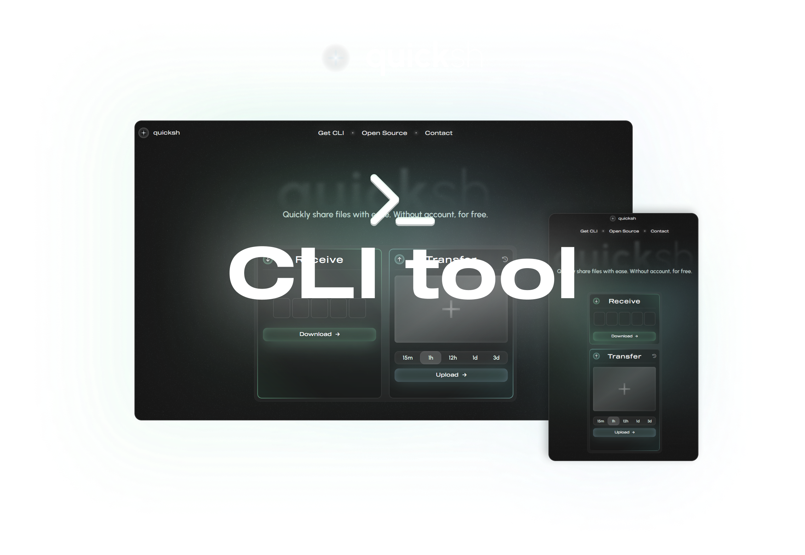

<div align="center">
    
</div>

<div align="center">
    <h2>✨ Overview</h2>
</div>

[quicksh.cc](https://quicksh.cc) is a **files sharing platform**. The main goal is to transfer files **as quickly as possible**. __No account, no ads, no popups or unnecessary clicks__.

#### This repo contains Command Line Interface for the [quicksh.cc](https://quicksh.cc) platform.

<div align="center">
    <h2>📦 Installation</h2>
</div>

You can either download the precompiled file from the [realeases](https://github.com/quickshcc/quicksh-cli/releases) tab or run it using Python3. 

1. Ensure Python3 and PiP are installed.

2. Download this repository.

3. Install dependencies using `pip install -r requirements.txt`.

4. Run CLI with `python3 main.py` or `py main.py`.

<div align="center">
    <h2>👁️ Usage</h2>
</div>

`...` - Means script starting command (eg. `py main.py` or `quicksh`, based on installation type.)

### ⬆️ Transfering.

```
... transfer [path?] [availability?]
```

(`transfer` can be replaced with `t`/`u`/`up`/`upload`)

If the `path` parameter is not provided, the system file selection window will popup.

When specifying the `path`, You can also select the availability period from one of the: `15m`/`1h`/`12h`/`1d`/`3d`

### 📦 Receiving.

```
... receive <code>
```

(`receive` can be replaced with `r`/`get`)

The `code` must be 5 digits number that leads to already shared file. You will get this code after transfering a file to the platform.

If the code is valid, file will be downloaded to the current working directory.

### 📜 History.

```
... list
```

(`list` can be replaced with the `l`)

Fetch list of the active shares transfered from Your IP address.

### 🗑️ Delete.

```
... delete <code>
```

(`delete` can be replaced with `d`/`del`/`rm`/`remove`)

Remove one of your transfered files. You can get the list of files using the `list` subcommand.
